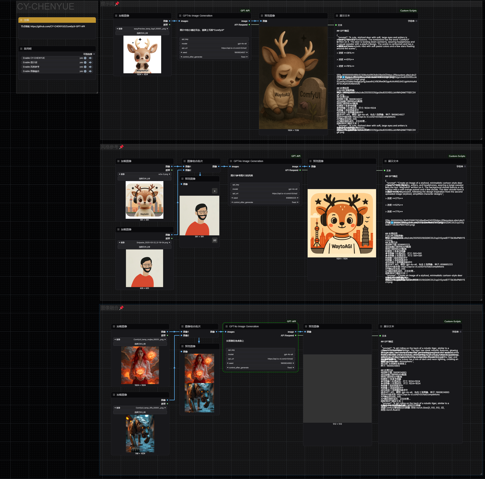

# ComfyUI-GPT-API

[English](README_EN.md) | 中文

通过API直接调用GPT系列模型的ComfyUI扩展节点集合。该项目提供了一系列自定义节点（计划）

## 安装方法

1. 下载或克隆这个仓库到ComfyUI的`custom_nodes`目录中：
```
cd ComfyUI/custom_nodes
git clone https://github.com/CY-CHENYUE/ComfyUI-GPT-API
```

2. 安装依赖项：
```
cd ComfyUI-GPT-API
pip install -r requirements.txt
```

3. 重启ComfyUI，节点将自动加载

## 节点使用指南

### GPT4o Image Generation (图像生成节点)

#### 功能简介

通过API直接调用GPT-4o生成图像，可使用参考图像引导生成过程。支持图像处理质量控制和随机种子设置。

#### 使用方法




1. 从节点浏览器中找到"GPT4o Image Generation"节点并添加到工作流中
2. 输入您的GPT API密钥、自定义API地址和模型名称（只需首次设置，将自动保存）
3. 编写图像生成提示词
4. 连接一个或多个参考图像到images输入（必需）
5. 设置随机种子和图像处理质量参数
6. 运行工作流，节点将调用API生成图像并返回

#### 节点参数说明

##### 必需参数
- **prompt**: 图像生成的提示词，描述您想要生成的图像内容
- **api_key**: OpenAI API密钥（首次设置后会自动保存）
- **model**: 使用的模型名称（如"gpt-4o-all"）
- **api_url**: API请求地址
- **images**: 用作参考的图像输入（支持多张图像）
- **seed**: 随机种子值

##### 可选参数
- **max_image_size**: 图像最大尺寸（默认1024像素）
- **image_quality**: JPEG压缩质量（50-100）
- **image_detail**: 图像处理质量，影响token消耗和处理细节
  - **auto**: 自动选择处理质量（默认）
  - **high**: 高品质处理，提供更多图像细节，但消耗更多token
  - **low**: 低品质处理，token消耗少，适合简单任务


## 注意事项

- 请确保您有有效的GPT API密钥
- API调用可能需要一定的时间，请耐心等待
- 图像生成受到API服务提供商的限制和规则约束
- 种子值设为0时系统会随机生成一个有效种子
- 所有配置（API密钥、URL、模型）将保存到节点本地目录，下次使用时自动加载
- 用户输入的参数总是优先于保存的配置

## 疑难解答

如果遇到安装或运行问题：

1. 确保已安装所有依赖项
2. 检查API密钥是否有效
3. 验证API URL是否正确
4. 确认使用的模型名称是服务商支持的
5. 检查网络连接是否正常
6. 查看节点返回的"API Respond"信息，获取详细错误信息

## Contact Me

- X (Twitter): [@cychenyue](https://x.com/cychenyue)
- TikTok: [@cychenyue](https://www.tiktok.com/@cychenyue)
- YouTube: [@CY-CHENYUE](https://www.youtube.com/@CY-CHENYUE)
- BiliBili: [@CY-CHENYUE](https://space.bilibili.com/402808950)
- 小红书: [@CY-CHENYUE](https://www.xiaohongshu.com/user/profile/6360e61f000000001f01bda0)