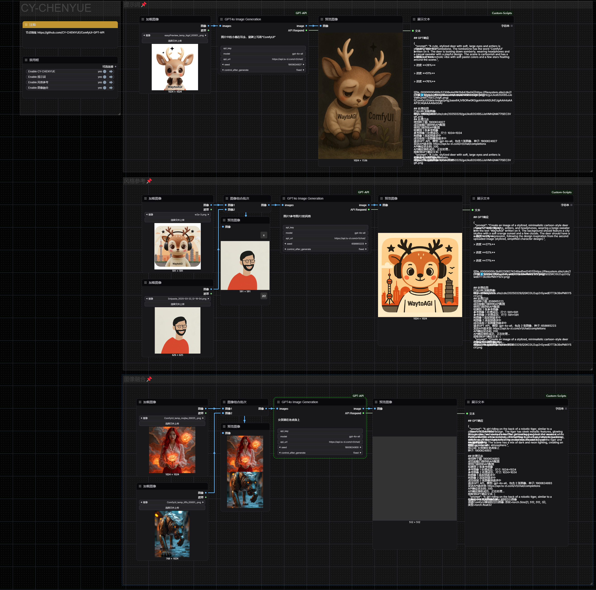

# ComfyUI-GPT-API

English | [中文](README.md)

A collection of ComfyUI extension nodes that directly call GPT models via API. This project provides a series of custom nodes (planned) for accessing various GPT capabilities in ComfyUI workflows.

## Installation

1. Download or clone this repository into the `custom_nodes` directory of ComfyUI:
```
cd ComfyUI/custom_nodes
git clone https://github.com/CY-CHENYUE/ComfyUI-GPT-API
```

2. Install dependencies:
```
cd ComfyUI-GPT-API
pip install -r requirements.txt
```

3. Restart ComfyUI, and the nodes will be automatically loaded

## Node Usage Guide

### GPT4o Image Generation

#### Features

Directly call GPT-4o via API to generate images, with the ability to use reference images to guide the generation process. Supports image quality control and random seed settings.

#### How to Use





1. Find the "GPT4o Image Generation" node in the node browser and add it to your workflow
2. Enter your GPT API key, custom API address, and model name (these only need to be set once and will be automatically saved)
3. Write your image generation prompt
4. Connect one or more reference images to the images input (required)
5. Set the random seed and image processing quality parameters
6. Run the workflow, and the node will call the API to generate an image and return it

#### Node Parameters

##### Required Parameters
- **prompt**: The image generation prompt that describes the image you want to create
- **api_key**: Your OpenAI API key (will be saved automatically after first use)
- **model**: The model name to use (e.g., "gpt-4o-all")
- **api_url**: The API endpoint URL
- **images**: Reference image input (supports multiple images)
- **seed**: Random seed value

##### Optional Parameters
- **max_image_size**: Maximum image dimension (default 1024 pixels)
- **image_quality**: JPEG compression quality (50-100)
- **image_detail**: Image processing quality, affects token usage and detail level
  - **auto**: Automatically select processing quality (default)
  - **high**: High-quality processing with more image details, but consumes more tokens
  - **low**: Low-quality processing, uses fewer tokens, suitable for simple tasks

## Notes

- Please ensure you have a valid GPT API key
- API calls may take some time, please be patient
- Image generation is subject to the limitations and rules of the API service provider
- When the seed value is set to 0, the system will generate a random valid seed
- All configurations (API key, URL, model) will be saved to the node's local directory and automatically loaded next time
- User-provided parameters always take precedence over saved configurations

## Troubleshooting

If you encounter installation or operation issues:

1. Make sure all dependencies are installed
2. Check if your API key is valid
3. Verify that the API URL is correct
4. Confirm that the model name is supported by the service provider
5. Check your network connection
6. Review the "API Respond" information returned by the node for detailed error messages

## Contact Me

- X (Twitter): [@cychenyue](https://x.com/cychenyue)
- TikTok: [@cychenyue](https://www.tiktok.com/@cychenyue)
- YouTube: [@CY-CHENYUE](https://www.youtube.com/@CY-CHENYUE)
- BiliBili: [@CY-CHENYUE](https://space.bilibili.com/402808950)
- Xiaohongshu: [@CY-CHENYUE](https://www.xiaohongshu.com/user/profile/6360e61f000000001f01bda0) 